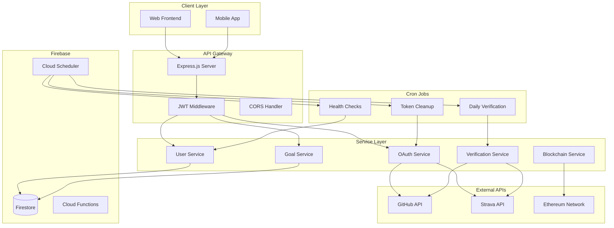

# Design Document

## Overview

This design outlines the migration from MongoDB/Mongoose to Firebase Firestore, implementation of OAuth integrations for GitHub and Strava, and the creation of automated verification systems. The architecture emphasizes security, scalability, and maintainability while preserving existing blockchain functionality.

## Architecture

### High-Level System Architecture



### Database Schema Migration

#### Firestore Collections Structure

```typescript
// Users Collection: /users/{userId}
interface UserDocument {
  walletAddress: string;
  fid?: number;
  profile: {
    displayName?: string;
    email?: string;
    avatar?: string;
  };
  connectedAccounts: {
    github?: {
      username: string;
      userId: string;
      accessToken: string; // encrypted
      refreshToken?: string; // encrypted
      connectedAt: Timestamp;
      lastSyncAt?: Timestamp;
      isActive: boolean;
    };
    strava?: {
      username: string;
      athleteId: string;
      accessToken: string; // encrypted
      refreshToken: string; // encrypted
      connectedAt: Timestamp;
      lastSyncAt?: Timestamp;
      isActive: boolean;
    };
  };
  preferences: {
    notifications: boolean;
    timezone: string;
    currency: 'ETH' | 'USDC';
  };
  createdAt: Timestamp;
  updatedAt: Timestamp;
}

// Goals Collection: /goals/{goalId}
interface GoalDocument {
  userId: string;
  title: string;
  description?: string;
  goalType: 'fitness' | 'coding' | 'reading' | 'health' | 'custom';
  metric: string;
  targetValue: number;
  currentValue: number;
  stakeAmount: number;
  currency: 'ETH' | 'USDC';
  contractAddress: string;
  deadline: Timestamp;
  status: 'active' | 'completed' | 'failed' | 'pending_verification' | 'cancelled';
  dataSource: {
    type: 'github' | 'strava' | 'manual';
    config: Record<string, any>; // source-specific configuration
  };
  verificationResult?: {
    achieved: boolean;
    actualValue: number;
    verifiedAt: Timestamp;
    txHash: string;
    verificationMethod: string;
  };
  milestones: GoalMilestone[];
  createdAt: Timestamp;
  updatedAt: Timestamp;
}

// Goal Milestones Subcollection: /goals/{goalId}/milestones/{milestoneId}
interface GoalMilestone {
  date: Timestamp;
  value: number;
  source: 'api' | 'manual';
  metadata?: Record<string, any>;
}

// Verification Logs Collection: /verification_logs/{logId}
interface VerificationLog {
  goalId: string;
  userId: string;
  timestamp: Timestamp;
  status: 'success' | 'failure' | 'error';
  dataSource: string;
  result?: {
    previousValue: number;
    newValue: number;
    dataPoints: any[];
  };
  error?: {
    code: string;
    message: string;
    stack?: string;
  };
}
```

## Components and Interfaces

### 1. Firebase Service Layer

```typescript
// Firebase Configuration Service
class FirebaseService {
  private db: Firestore;
  private auth: Auth;
  
  async initializeFirebase(): Promise<void>;
  async getCollection<T>(collectionName: string): Promise<CollectionReference<T>>;
  async createDocument<T>(collection: string, data: T): Promise<string>;
  async updateDocument<T>(collection: string, id: string, data: Partial<T>): Promise<void>;
  async deleteDocument(collection: string, id: string): Promise<void>;
  async queryDocuments<T>(collection: string, queries: Query[]): Promise<T[]>;
}

// User Repository
class UserRepository {
  async createUser(userData: CreateUserRequest): Promise<UserDocument>;
  async getUserById(userId: string): Promise<UserDocument | null>;
  async getUserByWallet(walletAddress: string): Promise<UserDocument | null>;
  async updateUser(userId: string, updates: Partial<UserDocument>): Promise<void>;
  async updateConnectedAccount(userId: string, provider: 'github' | 'strava', accountData: any): Promise<void>;
  async disconnectAccount(userId: string, provider: 'github' | 'strava'): Promise<void>;
}

// Goal Repository
class GoalRepository {
  async createGoal(goalData: CreateGoalRequest): Promise<GoalDocument>;
  async getGoalById(goalId: string): Promise<GoalDocument | null>;
  async getUserGoals(userId: string, filters?: GoalFilters): Promise<GoalDocument[]>;
  async updateGoalProgress(goalId: string, currentValue: number): Promise<void>;
  async updateGoalStatus(goalId: string, status: GoalStatus): Promise<void>;
  async getActiveGoals(): Promise<GoalDocument[]>;
  async addMilestone(goalId: string, milestone: GoalMilestone): Promise<void>;
}
```

### 2. OAuth Integration Services

```typescript
// OAuth Service Interface
interface OAuthService {
  getAuthorizationUrl(userId: string, redirectUri: string): string;
  handleCallback(code: string, state: string): Promise<OAuthTokens>;
  refreshTokens(refreshToken: string): Promise<OAuthTokens>;
  revokeTokens(accessToken: string): Promise<void>;
}

// GitHub OAuth Service
class GitHubOAuthService implements OAuthService {
  private clientId: string;
  private clientSecret: string;
  private scopes: string[] = ['user', 'repo'];
  
  async getAuthorizationUrl(userId: string, redirectUri: string): Promise<string>;
  async handleCallback(code: string, state: string): Promise<GitHubTokens>;
  async refreshTokens(refreshToken: string): Promise<GitHubTokens>;
  async getUserProfile(accessToken: string): Promise<GitHubUser>;
  async getUserRepositories(accessToken: string): Promise<GitHubRepository[]>;
  async getUserCommits(accessToken: string, since: Date): Promise<GitHubCommit[]>;
}

// Strava OAuth Service
class StravaOAuthService implements OAuthService {
  private clientId: string;
  private clientSecret: string;
  private scopes: string[] = ['read', 'activity:read'];
  
  async getAuthorizationUrl(userId: string, redirectUri: string): Promise<string>;
  async handleCallback(code: string, state: string): Promise<StravaTokens>;
  async refreshTokens(refreshToken: string): Promise<StravaTokens>;
  async getAthleteProfile(accessToken: string): Promise<StravaAthlete>;
  async getActivities(accessToken: string, after: Date, before: Date): Promise<StravaActivity[]>;
  async getAthleteStats(accessToken: string): Promise<StravaStats>;
}
```

### 3. Data Verification Services

```typescript
// Verification Service
class VerificationService {
  private githubService: GitHubDataService;
  private stravaService: StravaDataService;
  private goalRepository: GoalRepository;
  
  async verifyGoal(goalId: string): Promise<VerificationResult>;
  async verifyAllActiveGoals(): Promise<VerificationSummary>;
  async calculateProgress(goal: GoalDocument, user: UserDocument): Promise<number>;
  private async logVerification(goalId: string, result: VerificationResult): Promise<void>;
}

// GitHub Data Service
class GitHubDataService {
  async getCommitCount(user: UserDocument, since: Date, until: Date): Promise<number>;
  async getLinesOfCode(user: UserDocument, since: Date, until: Date): Promise<number>;
  async getRepositoryCount(user: UserDocument, since: Date, until: Date): Promise<number>;
  async getContributionStreak(user: UserDocument): Promise<number>;
}

// Strava Data Service
class StravaDataService {
  async getTotalDistance(user: UserDocument, since: Date, until: Date): Promise<number>;
  async getTotalCalories(user: UserDocument, since: Date, until: Date): Promise<number>;
  async getActivityCount(user: UserDocument, since: Date, until: Date): Promise<number>;
  async getActiveMinutes(user: UserDocument, since: Date, until: Date): Promise<number>;
}
```

### 4. Cron Job Architecture

```typescript
// Cron Job Manager
class CronJobManager {
  private jobs: Map<string, CronJob> = new Map();
  
  async initializeJobs(): Promise<void>;
  async startJob(jobName: string): Promise<void>;
  async stopJob(jobName: string): Promise<void>;
  async getJobStatus(jobName: string): Promise<JobStatus>;
}

// Daily Verification Job
class DailyVerificationJob {
  private schedule: string = '0 0 * * *'; // Daily at midnight
  
  async execute(): Promise<void>;
  private async processGoalsBatch(goals: GoalDocument[]): Promise<void>;
  private async handleVerificationError(goalId: string, error: Error): Promise<void>;
}

// Token Cleanup Job
class TokenCleanupJob {
  private schedule: string = '0 2 * * *'; // Daily at 2 AM
  
  async execute(): Promise<void>;
  private async cleanupExpiredTokens(): Promise<void>;
  private async refreshExpiredTokens(): Promise<void>;
}
```

## Data Models

### OAuth Token Management

```typescript
interface OAuthTokens {
  accessToken: string;
  refreshToken?: string;
  expiresAt: Date;
  scope: string[];
}

interface EncryptedTokens {
  accessToken: string; // encrypted
  refreshToken?: string; // encrypted
  expiresAt: Timestamp;
  scope: string[];
}
```

### API Response Models

```typescript
// GitHub API Models
interface GitHubUser {
  id: number;
  login: string;
  name: string;
  email: string;
  avatar_url: string;
}

interface GitHubCommit {
  sha: string;
  commit: {
    author: {
      name: string;
      email: string;
      date: string;
    };
    message: string;
  };
  stats: {
    additions: number;
    deletions: number;
    total: number;
  };
}

// Strava API Models
interface StravaAthlete {
  id: number;
  username: string;
  firstname: string;
  lastname: string;
  profile: string;
}

interface StravaActivity {
  id: number;
  name: string;
  distance: number;
  moving_time: number;
  elapsed_time: number;
  total_elevation_gain: number;
  type: string;
  start_date: string;
  calories?: number;
}
```

## Error Handling

### Error Classification System

```typescript
enum ErrorType {
  AUTHENTICATION = 'AUTHENTICATION',
  AUTHORIZATION = 'AUTHORIZATION',
  RATE_LIMIT = 'RATE_LIMIT',
  API_ERROR = 'API_ERROR',
  NETWORK_ERROR = 'NETWORK_ERROR',
  VALIDATION_ERROR = 'VALIDATION_ERROR',
  DATABASE_ERROR = 'DATABASE_ERROR',
  BLOCKCHAIN_ERROR = 'BLOCKCHAIN_ERROR'
}

class AppError extends Error {
  constructor(
    public type: ErrorType,
    public message: string,
    public statusCode: number = 500,
    public retryable: boolean = false,
    public metadata?: Record<string, any>
  ) {
    super(message);
  }
}
```

### Retry Strategy

```typescript
interface RetryConfig {
  maxAttempts: number;
  baseDelay: number;
  maxDelay: number;
  backoffMultiplier: number;
  retryableErrors: ErrorType[];
}

class RetryService {
  async executeWithRetry<T>(
    operation: () => Promise<T>,
    config: RetryConfig
  ): Promise<T>;
}
```

## Testing Strategy

### Unit Testing
- **Service Layer**: Mock external APIs and database calls
- **Repository Layer**: Test Firestore operations with emulator
- **OAuth Services**: Mock OAuth providers and test token handling
- **Verification Logic**: Test calculation algorithms with sample data

### Integration Testing
- **API Endpoints**: Test complete request/response cycles
- **OAuth Flow**: Test complete authorization flows with test accounts
- **Cron Jobs**: Test scheduled job execution and error handling
- **Database Operations**: Test with Firestore emulator

### End-to-End Testing
- **Goal Creation Flow**: Create goal → Connect account → Verify progress
- **OAuth Integration**: Complete authorization flow for both providers
- **Verification Process**: Test automated verification with real API data
- **Error Scenarios**: Test various failure modes and recovery

### Performance Testing
- **API Rate Limits**: Test handling of GitHub/Strava rate limits
- **Concurrent Users**: Test system under load with multiple users
- **Database Queries**: Test Firestore query performance and optimization
- **Cron Job Performance**: Test verification job with large datasets

## Security Considerations

### Token Security
- **Encryption**: All OAuth tokens encrypted at rest using AES-256
- **Key Management**: Use Firebase Security Rules and Cloud KMS
- **Token Rotation**: Automatic refresh token rotation
- **Secure Storage**: Tokens stored in encrypted Firestore fields

### API Security
- **Rate Limiting**: Implement per-user and global rate limits
- **Input Validation**: Validate all inputs using Joi schemas
- **CORS Configuration**: Restrict origins in production
- **Authentication**: JWT tokens with short expiration times

### Privacy Protection
- **Data Minimization**: Only store necessary user data
- **User Consent**: Clear consent flow for data access
- **Data Deletion**: Complete data removal on account deletion
- **Audit Logging**: Log all sensitive operations

## Deployment and Infrastructure

### Environment Configuration
```typescript
interface EnvironmentConfig {
  firebase: {
    projectId: string;
    apiKey: string;
    authDomain: string;
  };
  oauth: {
    github: {
      clientId: string;
      clientSecret: string;
      redirectUri: string;
    };
    strava: {
      clientId: string;
      clientSecret: string;
      redirectUri: string;
    };
  };
  encryption: {
    key: string;
    algorithm: string;
  };
  blockchain: {
    providerUrl: string;
    privateKey: string;
    contractAddress: string;
  };
}
```

### Monitoring and Logging
- **Application Metrics**: Response times, error rates, throughput
- **Business Metrics**: Goal completion rates, user engagement
- **Infrastructure Metrics**: Database performance, API usage
- **Error Tracking**: Comprehensive error logging and alerting